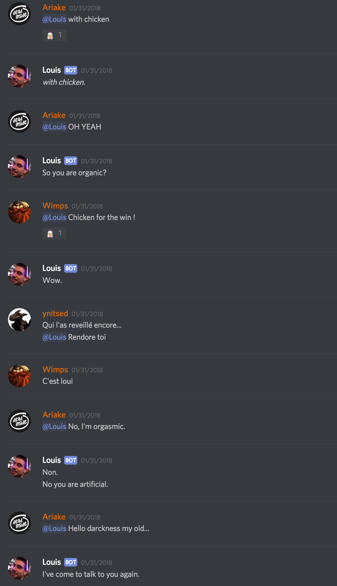

# Louis
Your average Discord Cleverbot.

Louis can talk to you in multiples languages, respond with gifs, add reactions to your messages ... More alive than the real one !

## demo





## Setup

You need to fill your credentials inside the ```config.json``` file

```
"cleverbot": {
  "apiUser": "CLEVERBOT_API_USER",
  "apiKey": "CLEVERBOT_API_KEY"
},
"discord": {
  "token": "DISCORD_TOKEN"
}
```

Just replace ```CLEVERBOT_API_USER```, ```CLEVERBOT_API_KEY``` by your [Cleverbot.io](https://cleverbot.io/) credentials.
And the ```DISCORD_TOKEN``` by the discord token of your app.
[How to get a your token](https://github.com/reactiflux/discord-irc/wiki/Creating-a-discord-bot-&-getting-a-token)

Once your crendentials are filled, just run ```node louis.js``` and enjoy

## Customise

You can customise message reactions, with triggers, edit bot general config, add personnal answers ... 
Just open the ```rules.json``` and fill the differents rules.

```
{
  "isEditable": true,
  "bot": {
    "name": "Louis",
    "speakRate": 10,
    "gifRate": 5
  },
  "giphy": {
    "searchLimit": 50
  },
  "channels": {
    "alwaysSpeak": [
      "talktolouis"
    ],
    "neverSpeak": [
    ]
  },
  "messages": [
    { "content": "chicken", "answer": "I love chicken !", "reaction": "🐔" },
    { "content": "poop", "reaction": "💩" }
  ]
}
```
